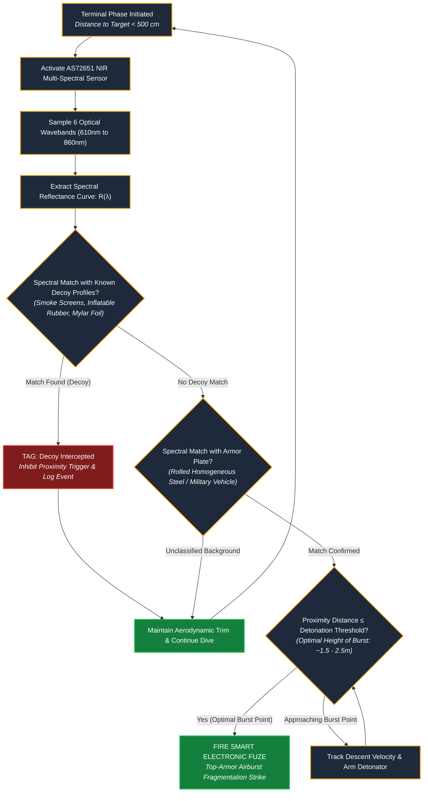

# 🎯 VECTOR 155mm Shell: Complete Engineering Flowcharts
### Smart India Hackathon 2026 | Problem Statement ID: 98 | Team Tenacity (R15-230)

This document provides complete, publication-ready architectural and operational flowcharts for **VECTOR** (*Velocity, Estimation, Correction & Trajectory Ogive Retrofit*). These diagrams can be copied directly into reports, research papers, and slide decks (Slide 3: Technical Approach & Methodology).

---

## 📋 Table of Contents
1. [Chart 1: Master End-to-End Flight & Guidance Architecture](#1-master-end-to-end-flight--guidance-architecture)
2. [Chart 2: Dual-Stage Outlier & Anti-Jamming Filter Pipeline](#2-dual-stage-outlier--anti-jamming-filter-pipeline)
3. [Chart 3: Battery-Less Electromagnetic Power & Decoupling Flow](#3-battery-less-electromagnetic-power--decoupling-flow)
4. [Chart 4: Multi-Spectral NIR Smart Proximity Fuze Logic](#4-multi-spectral-nir-smart-proximity-fuze-logic)

---

## 1. Master End-to-End Flight & Guidance Architecture

This flowchart traces the entire operational cycle of the VECTOR 155mm shell from howitzer launch through impact:

```mermaid
flowchart TD
    %% Styling Definitions
    classDef launch fill:#1e293b,stroke:#f59e0b,stroke-width:2px,color:#fff;
    classDef power fill:#132e22,stroke:#22c55e,stroke-width:2px,color:#fff;
    classDef sensors fill:#131f37,stroke:#38bdf8,stroke-width:2px,color:#fff;
    classDef ml fill:#2e1b13,stroke:#f59e0b,stroke-width:2px,color:#fff;
    classDef gnc fill:#1e1b4b,stroke:#818cf8,stroke-width:2px,color:#fff;
    classDef terminal fill:#371317,stroke:#ef4444,stroke-width:2px,color:#fff;

    %% STAGE 1: LAUNCH & SEPARATION
    subgraph S1 ["1. LAUNCH & MECHANICAL INITIALIZATION"]
        A["155mm Howitzer Firing<br><i>10,000G - 20,000G Set-back Force</i>"]:::launch --> B["Shock Absorption<br><i>Epoxy Resin Potting + Belleville Washers</i>"]:::launch
        B --> C["Barrel Rifling Imparts Spin<br><i>Shell Body: 15,000 - 20,000 RPM</i>"]:::launch
        C --> D["Mechanical Bearing Decoupling<br><i>Ogive Nose Cone Spin drops to < 200 RPM</i>"]:::launch
    end

    %% STAGE 2: POWER GENERATION
    subgraph S2 ["2. BATTERY-LESS INDUCTION POWER HARVESTING"]
        D --> E["Relative Rotational Differential<br><i>14,800 RPM Delta (Body vs Ogive)</i>"]:::power
        E --> F["N52 Magnets spin past Stationary Coils<br><i>Faraday's Law Electromagnetic Induction</i>"]:::power
        F --> G["Power Conditioning Circuit<br><i>Regulated 3.3V & 5.0V Ultracapacitor Rails</i>"]:::power
    end

    %% STAGE 3: SENSOR ACQUISITION
    subgraph S3 ["3. HIGH-RATE SENSOR ACQUISITION (10 Hz)"]
        G --> H["MCU Bootstrapping<br><i>STM32F446 / ESP32 Core</i>"]:::sensors
        H --> I1["ICM-20948 9-DOF IMU<br><i>3-Axis Accel + 3-Axis Gyro (200 RPM)</i>"]:::sensors
        H --> I2["BMP388 Barometer<br><i>Atmospheric Pressure & Baro Altitude</i>"]:::sensors
        H --> I3["u-blox NEO-M8N GNSS<br><i>GPS Coordinates: Lat, Lon, Alt</i>"]:::sensors
        H --> I4["AS72651 NIR Fuze<br><i>Multi-Spectral Distance & Reflectance</i>"]:::sensors
    end

    %% STAGE 4: ANTI-JAMMING ML ENGINE
    subgraph S4 ["4. DUAL-STAGE ANTI-JAMMING & OUTLIER FILTER"]
        I1 & I2 & I3 & I4 --> J["Raw Telemetry Ingestion Window<br><i>12-Parameter Packet Stream</i>"]:::ml
        J --> K{"Layer 1: Robust Kinematic MAD<br><i>Modified Z-Score |Z| > 3.5?</i>"}:::ml
        K -- "EW Jamming / Spike" --> L["Isolate Spoofed Value<br><i>Kinematic Velocity Extrapolation</i>"]:::ml
        K -- "Nominal Data" --> M["Pass Cleaned Packet"]:::ml
        L --> N{"Layer 2: Isolation Forest<br><i>Multivariate Correlation Drift?</i>"}:::ml
        M --> N
        N -- "Anomaly Found" --> O["Apply Kalman State Correction"]:::ml
        N -- "Nominal State" --> P["Validated Flight Telemetry"]:::ml
        O --> P
    end

    %% STAGE 5: GUIDANCE, NAVIGATION & CONTROL
    subgraph S5 ["5. CLOSED-LOOP TRAJECTORY CONTROL (GNC)"]
        P --> Q["Extended Kalman Filter (EKF)<br><i>Sensor Fusion State Estimation</i>"]:::gnc
        Q --> R["Trajectory Deviation Computer<br><i>Actual Arc vs Target Coordinate Arc</i>"]:::gnc
        R --> S["PID Control Loop<br><i>Proportional-Integral-Derivative</i>"]:::gnc
        S --> T["PWM Actuator Commands<br><i>4x EMAX Metal Gear Canard Servos</i>"]:::gnc
        T --> U["Aerodynamic Canard Deflection<br><i>Pitch & Yaw Lift Trim (COP behind COG)</i>"]:::gnc
        U --> Q
    end

    %% STAGE 6: TERMINAL ATTACK & SMART FUZE
    subgraph S6 ["6. TERMINAL HOMING & PROXIMITY FUZING"]
        U --> V{"Terminal Proximity Check<br><i>Distance to Target < 5.0m?</i>"}:::terminal
        V -- "No (In Mid-Course)" --> Q
        V -- "Yes (Terminal Zone)" --> W["AS72651 NIR Spectral Signature Scan<br><i>Rolled Steel vs Foliage / Decoys</i>"]:::terminal
        W --> X{"Genuine Military Target Confirmed?"}:::terminal
        X -- "False Target / Decoy" --> Y["Inhibit Early Detonation<br><i>Continue Terminal Dive</i>"]:::terminal
        Y --> V
        X -- "Target Verified" --> Z["SMART PROXIMITY AIRBURST DETONATION<br><i>Top-Armor Strike &bull; CEP < 0.82m</i>"]:::terminal
    end
```



---

## 2. Dual-Stage Outlier & Anti-Jamming Filter Pipeline

This diagram shows how `outlier_detector.py` eliminates Electronic Warfare (EW) jamming and sensor drift:

```mermaid
flowchart TD
    classDef input fill:#0f172a,stroke:#38bdf8,stroke-width:2px,color:#fff;
    classDef decision fill:#1e293b,stroke:#f59e0b,stroke-width:2px,color:#fff;
    classDef process fill:#14231b,stroke:#22c55e,stroke-width:2px,color:#fff;
    classDef alert fill:#311315,stroke:#ef4444,stroke-width:2px,color:#fff;

    IN["Incoming Telemetry Packet (100ms interval)<br><i>accel(x,y,z), gyro(x,y,z), P, T, dist, lat, lon, alt</i>"]:::input --> B1["Separate Stationary vs Kinematic Drift Fields"]:::process

    subgraph L1 ["LAYER 1: ROBUST KINEMATIC & MODIFIED Z-SCORE FILTER"]
        B1 --> C1["Compute Step-to-Step Kinematic Deltas<br><i>Δlat, Δlon, Δalt, ΔP</i>"]:::process
        C1 --> D1{"Check Physical Rate Bounds<br><i>e.g., |Δalt| > 35m/100ms?</i>"}:::decision
        D1 -- "Physical Bound Exceeded (EW Spike)" --> E1["FLAG: Physical Rate Outlier"]:::alert
        D1 -- "Within Physical Bounds" --> F1["Rolling Window (N=50) MAD Computation<br><i>Median Absolute Deviation</i>"]:::process
        F1 --> G1["Calculate Modified Z-Score<br><i>Z = 0.6745 * (Δ - Median) / MAD</i>"]:::process
        G1 --> H1{"Is |Z| > 3.5?"}:::decision
        H1 -- "Yes (Statistical Anomaly)" --> E1
        H1 -- "No (Nominal Point)" --> I1["Accept Raw Value & Update Last Good State"]:::process
        E1 --> J1["Imputation Engine:<br><i>Velocity Extrapolation from Last Known Good State</i>"]:::process
    end

    subgraph L2 ["LAYER 2: MULTIVARIATE ISOLATION FOREST CHECK"]
        I1 & J1 --> K2{"Buffer Length ≥ 30 Samples?"}:::decision
        K2 -- "No (Warm-up Phase)" --> L2["Bypass Layer 2 Check"]:::process
        K2 -- "Yes" --> M2{"Step Counter % 20 == 0?"}:::decision
        M2 -- "Periodic Check Triggered" --> N2["Extract Joint 12-Feature Matrix"]:::process
        M2 -- "Between Checks" --> L2
        N2 --> O2["Run Scikit-Learn IsolationForest Predict<br><i>Contamination Factor = 0.05</i>"]:::process
        O2 --> P2{"Isolation Score == -1?"}:::decision
        P2 -- "Multivariate Correlation Drift" --> Q2["FLAG: Multivariate Outlier<br><i>Cross-Axis Sensor Desync Detected</i>"]:::alert
        P2 -- "Nominal Joint Behavior" --> R2["CONFIRM: Multivariate Nominal"]:::process
    end

    L2 & Q2 & R2 --> OUT["Cleaned Telemetry Packet Stream<br><i>Forwarded to Web GCS & EKF Guidance Loop</i>"]:::input
```

---

## 3. Battery-Less Electromagnetic Power & Decoupling Flow

This diagram illustrates how mechanical bearing decoupling and induction power generation solve the two hardest physics problems of 155mm shells:

```mermaid
flowchart LR
    classDef mech fill:#1e293b,stroke:#94a3b8,stroke-width:2px,color:#fff;
    classDef spin fill:#172554,stroke:#38bdf8,stroke-width:2px,color:#fff;
    classDef mag fill:#2e1065,stroke:#c084fc,stroke-width:2px,color:#fff;
    classDef elec fill:#14532d,stroke:#22c55e,stroke-width:2px,color:#fff;

    A["Gun Barrel Rifling"]:::mech --> B["Shell Body Spins<br><b>15,000 to 20,000 RPM</b>"]:::spin
    B --> C["High-Load Ball Bearings<br><i>Belleville Shock Washers</i>"]:::mech
    C --> D["Decoupled Ogive (Nose Cone)<br><b>Reduced to < 200 RPM</b>"]:::spin

    B --> E["Neodymium N52 Bar Magnets<br><i>Mounted to Spinning Shell Collar</i>"]:::mag
    D --> F["Stationary Induction Copper Coils<br><i>Housed Inside Decoupled Ogive</i>"]:::mag

    E & F --> G["Relative Speed Differential:<br><b>Δ 14,800 RPM</b>"]:::mag
    G --> H["Faraday Magnetic Induction<br><i>Continuous Alternating Current (AC)</i>"]:::elec
    H --> I["Schottky Diode Rectification & Buck-Boost"]:::elec
    I --> J["Dual Ultracapacitor Bank<br><b>3.3V Logic / 5.0V Servo Rails</b>"]:::elec
    J --> K["Zero Chemical Batteries<br><b>Infinite Storage Shelf Life</b>"]:::elec
```



---

## 4. Multi-Spectral NIR Smart Proximity Fuze Logic

This diagram details the target classification and decoy rejection algorithm running on the AS72651 sensor:



---

## 🛠️ How to Export or Embed These Flowcharts

1. **In GitHub or Markdown Viewers**: GitHub, VS Code, and modern markdown renderers display these diagrams automatically using native Mermaid support.
2. **In PowerPoint (`Tenacity - Aim Bot.pptx`)**:
   - Open [`flowchart.html`](file:///c:/Users/UTKARSH%20BHANDARI/OneDrive/Desktop/sih/flowchart.html) in your browser.
   - Click **"Export as High-Res Image"** or take a clean screenshot.
   - Paste directly into **Slide 3 (Technical Approach & Methodology)**.
3. **In Technical Documentation / PDF Reports**:
   - Use the Mermaid CLI or Markdown-to-PDF tools to export publication-quality vector diagrams.

---
*Created for Team Tenacity (R15-230) — Smart India Hackathon 2026*
